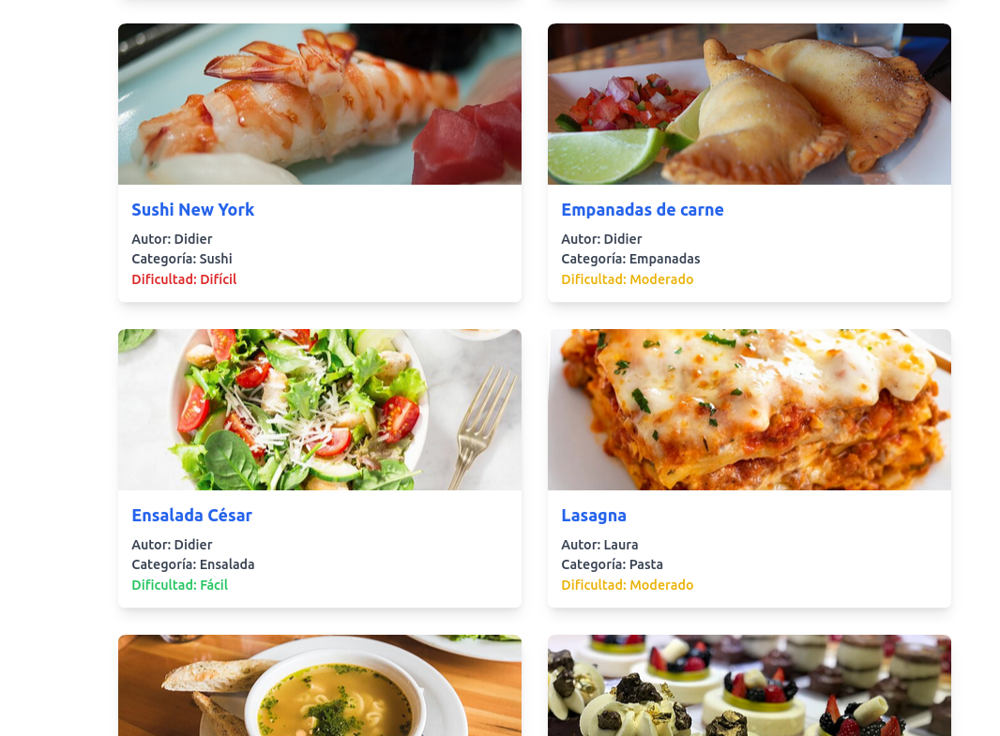
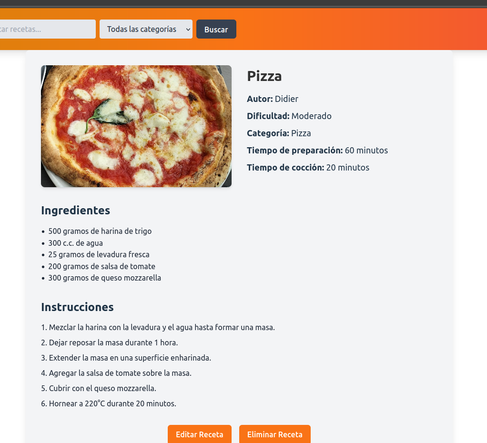

# Aplicación de Recetas de Cocina



## Índice

1. [Descripción](#descripción)
2. [Características](#características)
3. [Tecnologías](#tecnologías)
4. [Instalación](#instalación)
5. [Cómo usar](#cómo-usar)
   - [Cargar Datos de Prueba](#cargar-datos-de-prueba)
   - [Iniciar Sesión o Registrarse](#iniciar-sesión-o-registrarse)
   - [Agregar una Receta](#agregar-una-receta)
   - [Editar o Eliminar Recetas](#editar-o-eliminar-recetas)
   - [Seguir Recetas](#seguir-recetas)
   - [Administración desde el Perfil](#administración-desde-el-perfil)
6. [Licencia](#licencia)

## Descripción

Esta es una aplicación de recetas de cocina desarrollada en React. La aplicación permite a los usuarios gestionar recetas de cocina, incluyendo crear, leer, actualizar y eliminar recetas. Los usuarios pueden gestionar sus propias recetas y realizar seguimiento de recetas de otros usuarios. Los datos se almacenan en `localStorage` para persistencia en el navegador.

## Características

- **Gestión de Recetas**: CRUD (Crear, Leer, Actualizar, Eliminar) para recetas.
- **Autenticación de Usuarios**: Inicio de sesión para gestionar recetas privadas.
- **Persistencia de Datos**: Uso de `localStorage` para guardar recetas y estado de la aplicación.
- **Rutas Dinámicas**: Las rutas cambian dinámicamente según el estado de autenticación del usuario.



## Tecnologías

- **React**: Biblioteca principal para la construcción de la interfaz de usuario.
- **React Router**: Para la gestión de rutas y navegación en la aplicación.
- **React Hook Form**: Manejo eficiente de formularios y validación en - **la aplicación.
- **Yup**: Para la validación de formularios junto con React Hook Form.
- **Axios**: Cliente HTTP para interactuar con APIs y hacer peticiones.
- **Tailwind CSS**: Framework de utilidades CSS que permite diseñar de forma rápida y eficaz.
- **Vite**: Herramienta de desarrollo rápida para la construcción y optimización de aplicaciones React.

## Instalación

1. Clona el repositorio:
   ```bash
   git clone https://github.com/Did11/oliva-recipes-app.git
    ```

2. Navega hacia el directorio:
    ```bash
    cd oliva-recipes-app/recipes-app
    ```

3. Instala las dependencias:
   ```bash
   npm install
    ```

4. Ejecuta la aplicacion:
    ```bash
    npm run dev
    ```

5. Abre tu navegador y visita http://localhost:5173/ para ver la aplicación en funcionamiento.


## Cómo usar

### Cargar Datos de Prueba:
- Para cargar datos preconfigurados, haz clic en el botón **"Cargar Datos"** en la página de inicio, lo que facilita la evaluación de las funcionalidades de la aplicación.

### Iniciar Sesión o Registrarse:
- Regístrate proporcionando un nombre de usuario y contraseña.
- Al registrarte, iniciarás sesión automáticamente
- Puedes cerrar sesión y volver a iniciarla cuantas veces quieras.

### Agregar una Receta:
- Después de iniciar sesión, puedes agregar nuevas recetas llenando los campos necesarios, como título, tiempo de preparación, ingredientes e instrucciones.

### Editar o Eliminar Recetas:
- Solo el autor de la receta puede editar o eliminar una receta.

### Seguir Recetas:
- Los usuarios pueden seguir recetas de otros usuarios para tener un acceso rápido a sus recetas favoritas.

### Administración desde el Perfil:
- Los usuarios puede administrar las recetas que ha creado o sigue desde su perfil.

## Créditos

Este proyecto fue desarrollado por **Didier Oliva** como parte de un trabajo académico. 

## Licencia

Este proyecto está licenciado bajo la [Licencia MIT](./LICENSE). Consulta el archivo LICENSE para más detalles.
